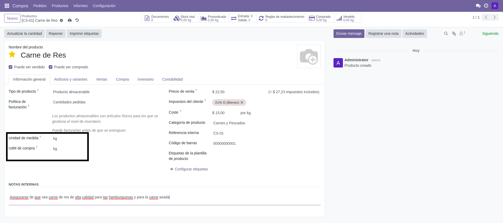
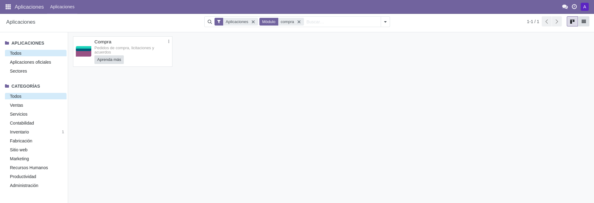
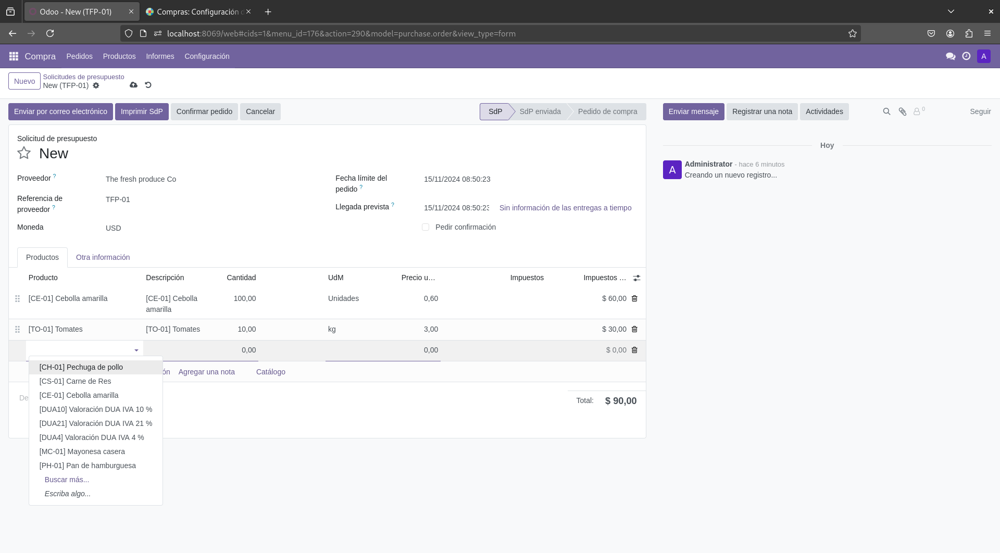
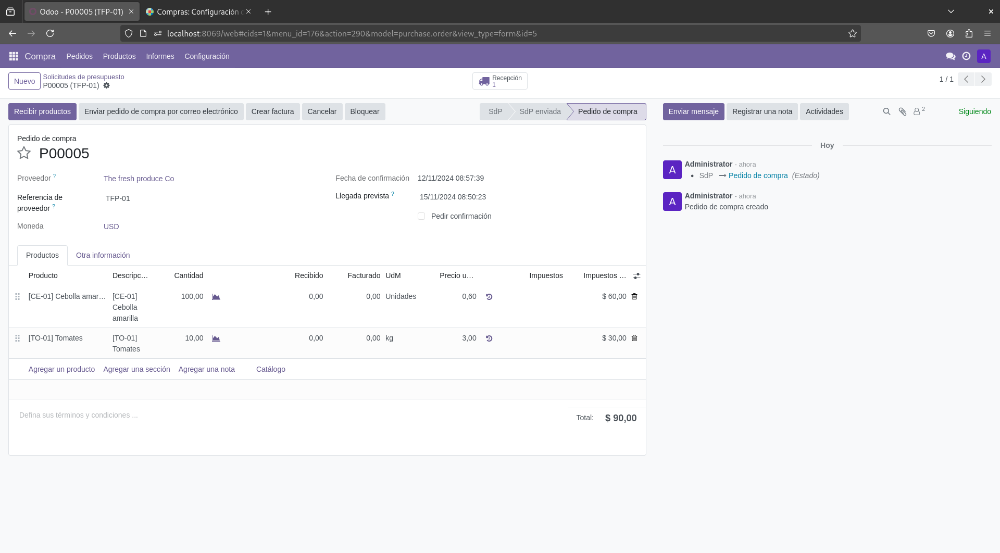

#Tutorial: **Instalación y configuración de módulos**

##**Módulo: Costos**

## 1. **Introducción**
Este tutorial es una guía a través del proceso de instalación y configuración del módulo de costos en Odoo

## 2. **Instalación del módulo de costos**
1. Acceder a Odoo
2. Dirigirse al menú de aplicaciones
3. Verificar que los módulos compra, contabilidad, inventario y ventas estén instalados previamente
4. Buscar el módulo de **productos y listas de precios** o ** costos**
5. Activar el módulo

## 3. **Configuración del módulo**
1. Dirigirse a configuración
2. En los apartados de compra e inventario habilitar las funciones de producto 
3. Activar variantes y las unidades de medida

## 4. **Crear productos y añadir costos**
1. Dirigirse a inventario o compras
2. Seleccionar productos
3. Crear Nuevo producto

4. Rellenar campos con detalles del producto

5. Al definir la unidad de medida del producto se desplega la tabla de unidades; seleccionar la deseada

 
6. Añadir costos
7. Guardar

##**Módulo: Compra**

## 1. **Introducción**
Este tutorial es una guía a través del proceso de instalación y configuración del módulo de compras en odoo

## 2. **Instalación del módulo de costos**
1. Acceder a Odoo
2. Dirigirse al menú de aplicaciones
3. Verificar que los módulos contabilidad, inventario y ventas estén instalados previamente
4. Buscar el módulo de **compra**
5. Instalar el módulo

## 3. **Crear productos y añadir costos**
1. Dirigirse a compras
2. Crear nueva solicitud de presupuesto
3. Rellenar campos con detalles del proveedor y los productos

4. Guardar solicitud 

5. Al recibir los productos seleccionar **Recepcionar pedidos**

6. Una vez recepcionados seleccionar **Crear factura** y rellenar campos para proceso de pago 

7. Confirmar factura y validar traslado 

8. Al finalizar se puede visualizar el proceso de compra finalizado 

9. Al visualizar las compras de nuevo se pueden ver en detalle cada una de ellas 

