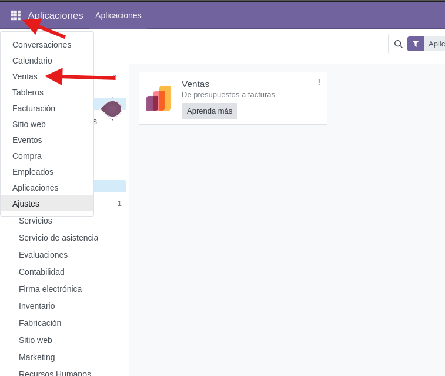
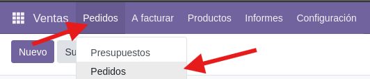
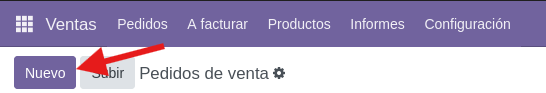
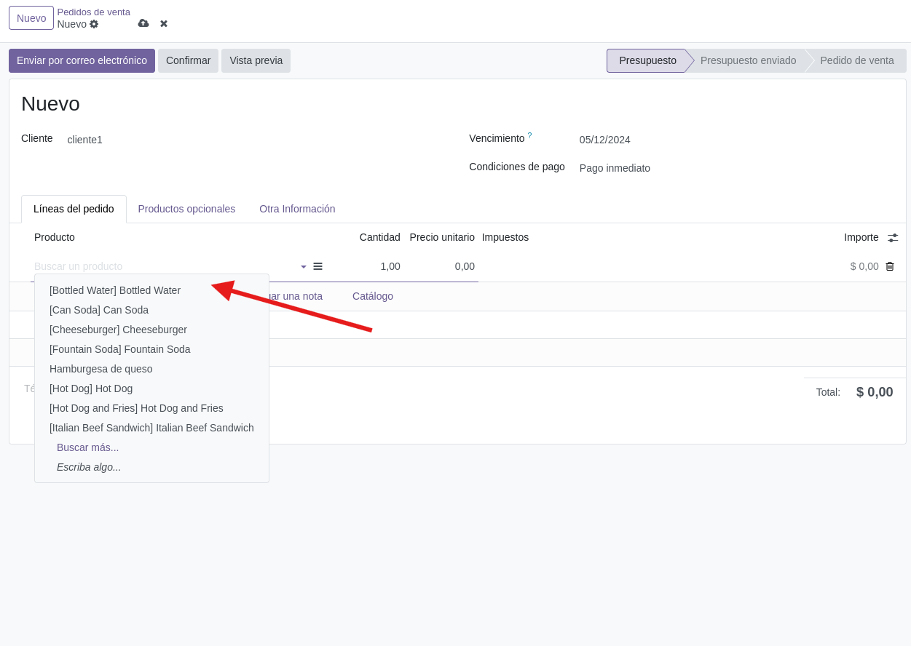
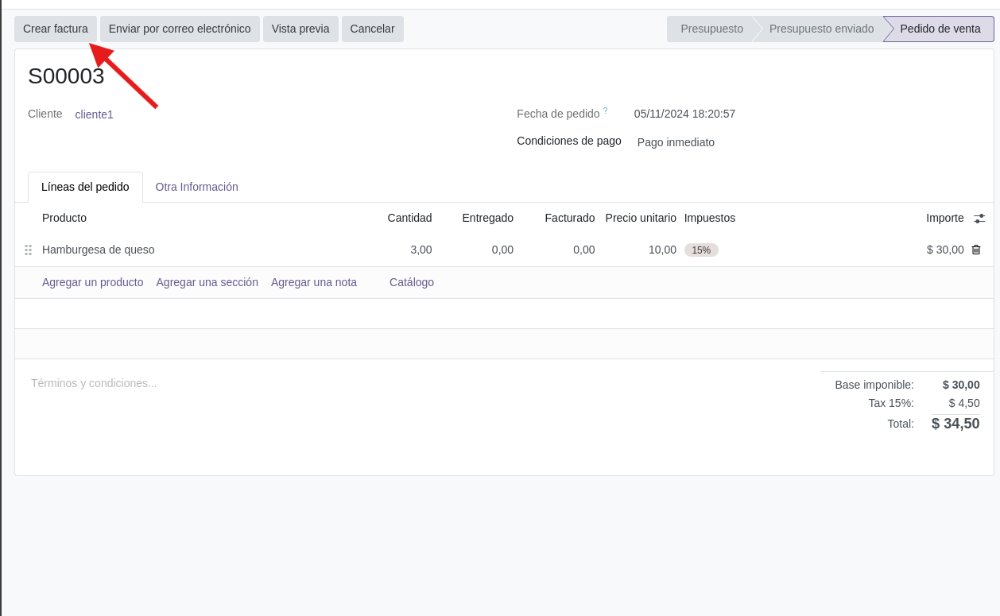
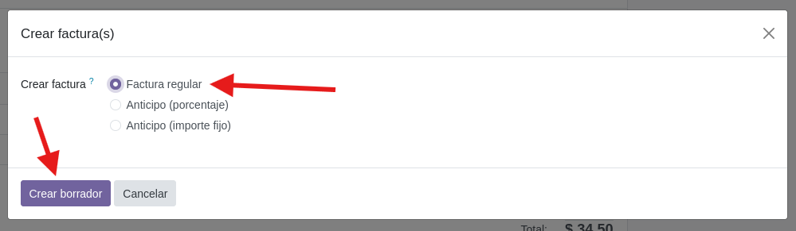
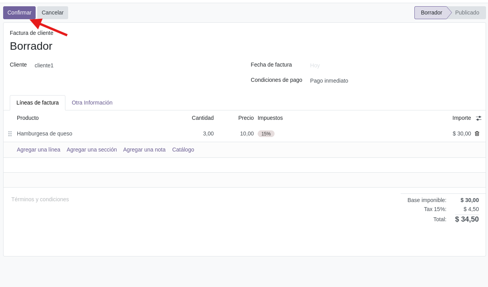

# SGE_A_GRUPC

## Modul Vendes

Primer per poder treballar amb el mòdul de Vendes hem d'instal·lar-lo.

#

Un cop instal·lat el mòdul ens dirigim a l'apartat vendes.

#

Com podem veure hi ha diversos apartats en aquest mòdul ens dirigirem a l'apartat de "Productos".

#

Per començar, afegirem productes per vendre'ls.

#

Primer, hem de posar-li un nom al producte, per exemple, "hamburguesa de formatge".

El tipus de producte serà marcat com a "bienes".

A la política de facturació, seleccionarem "quantitats demanades" per facturar els productes sol·licitats pel client.

#

A continuació, ens demana el preu de venda del producte, l'impost de venda del producte i el cost de compra del producte.

Finalment, assignarem una categoria al producte; si la categoria escrita no existeix, es crearà automàticament.

#

El producte es desarà automàticament. Si anem a l'apartat de productes, el podrem trobar allà.

#

El següent apartat que Carmy farà servir molt al seu restaurant serà el de "pedidos".

#

En aquest apartat, crearem comandes prement el botó de "Nuevo".

#

Això ens redirigirà a una nova pestanya on posarem el nom del client que ha fet la comanda. Si el client no és a la base de dades, es crearà automàticament.

#

A continuació, podem posar una data de venciment i les condicions per al pagament de la comanda.

#

Un cop configurades les opcions de pagament, és el moment d’afegir els productes.

#

Després d’afegir-los, fem clic a "Confirmar" i se’ns crearà automàticament la comanda de venda.

#

Quan el client ens hagi pagat la comanda, podrem fer clic al botó de "Crear factura".

#

Seleccionarem l'opció de factura regular i farem clic a "Crear borrador", tot i que també podem crear un anticipo de la factura si cal.

#

Un cop creat el borrador, premeu "Confirmar" i ja tindríem la factura creada, que podrem enviar per correu electrònic al client.

#

A part de poder crear pressupostos i factures, també podem fer un seguiment detallat de la quantitat de vendes que hem realitzat a l'apartat d'informes.

