# SGE_A_GRUPC

## Introducció dels integrants

- **Vazgen:** Soc Vazgen i estic interessat en el sistema ERP Odoo per les funcions de personalització que té amb el llenguatge Python.

- **Estefania:** Em dic Estefania, estic aprenent sobre els sistemes de gestió empresarial i estic interessada en com els sistemes ERP com Odoo poden transformar la productivitat i eficiència de les empreses.

- **Abigail:** Soc Abigail, m'interessa aprendre a utilitzar eines de gestió empresarial per optimitzar el treball a les empreses, estalviant temps i donant millors resultats.

## Repartició de tasques

- **Vazgen:** S’encarrega dels mòduls de Vendes i Calendari

- **Estefania:** S’encarrega dels mòduls d’Empleats i Events

- **Abigail** S’encarrega dels mòduls de Compres i Costos

## Presentació

Som una consultora especialitzada en oferir solucions tecnològiques a petites i mitjanes empreses, ajudant  així a optimitzat els seus processos mitjançant l’ús del software de gestió empresarial **Odoo**. El nostre objectiu és implementar eines adaptades a les necessitats específiques de cada negoci, millorant així la seva eficiència, productivitat i capacitat de creixement.

# Explicació de cada mòdul

## Mòdul d'Empleats

En aquest mòdul podem gestionar de forma eficient tota la informació de l'equip. Quan entrem, es poden observar diferents apartats com: **Empleats**, **Departaments**, **Informes** i la **Configuració dels Empleats**.

## Empleats

Fent clic en el nom de qualsevol empleat, accedeixes al seu perfil complet.
Al menú lateral pots veure i organitzar-los per departaments i crear nous equips si és necessari.

#### Crear un Nou Empleat

Al panell principal, selecciona **"Nou"** per afegir un nou membre al teu equip de treball. Dins d'aquest camp, has d'omplir certs camps clau que constitueixen la base de la informació laboral del nou treballador.

#### Camps Clau

A més, hi ha més apartats per omplir com:

- **Currículum**: És possible agregar una secció de currículum per documentar l'experiència prèvia i habilitats del treballador, facilitant així l'assignació de rols a _The Bear_.

  - **Experiència**: Es detalla l'historial laboral del treballador.

  - **Habilitats**: Llista les competències de l'empleat (ex: habilitats culinàries, gestió de personal, atenció al client).

Si fas clic a **"Agregar"**:
pots agregar diferents tipus d'habilitats

- **Informació de Treball**: Permet detallar aspectes específics de la posició de treball que ocuparà el treballador a _The Bear_.

- **Informació Privada**: Recopila les dades personals del treballador per a una gestió confidencial, essencial per a situacions legals o administratives.

- **Ajustos**: Inclou camps per personalitzar el tipus d'empleat, el seu cost per hora i el registre d'assistència.

  - En cas necessari, un codi PIN pot ser registrat pel registre d'entrada/sortida, o un ID de credencial es pot crear clicant a **"Generar"**.

## Departaments

Aquest apartat ofereix una vista organitzada dels diferents departaments dins l'empresa, junt amb el nombre d'empleats que hi ha en cadascun.

#### Crear un Nou Departament

Es pot crear un nou departament omplint els següents camps:

- **Nom**: especifica el nom del departament (ex: Marketing, RRHH).
- **Gerent**: selecciona la persona responsable del departament.
- **Departament Pare**: permet establir una jerarquia entre departaments.

## Configuració - Reclutament

Dins la secció de configuració, trobaràs diferents apartats com ara **Reclutament**, on podràs accedir a la llista de llocs de treball de la teva empresa.

### Crear un Nou Lloc de Treball

Fent clic a **"Nou"**, pots crear un nou lloc de treball ràpidament, simplement ingressant el nom desitjat.

## Modul Vendes

Primer per poder treballar amb el mòdul de Vendes hem d'instal·lar-lo.

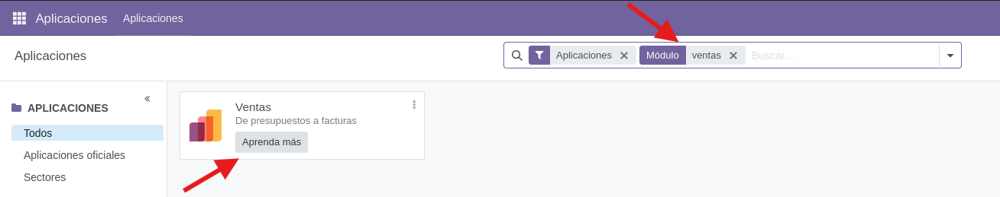

#

Un cop instal·lat el mòdul ens dirigim a l'apartat vendes.

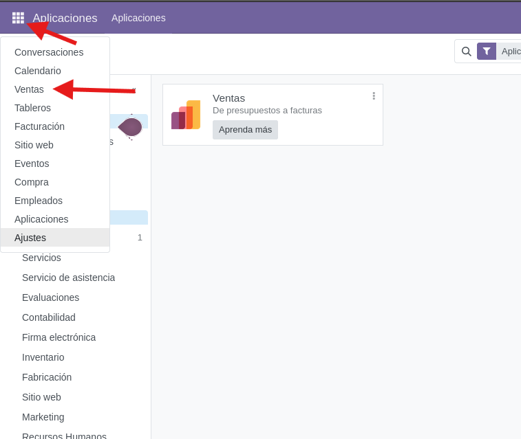

#

Com podem veure hi ha diversos apartats en aquest mòdul ens dirigirem a l'apartat de "Productos".

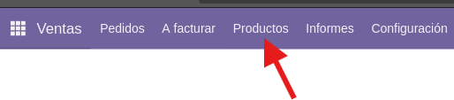

#

Per començar, afegirem productes per vendre'ls.

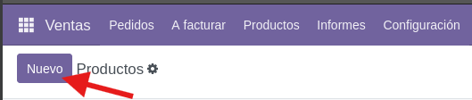

#

Primer, hem de posar-li un nom al producte, per exemple, "hamburguesa de formatge".

El tipus de producte serà marcat com a "bienes".

A la política de facturació, seleccionarem "quantitats demanades" per facturar els productes sol·licitats pel client.

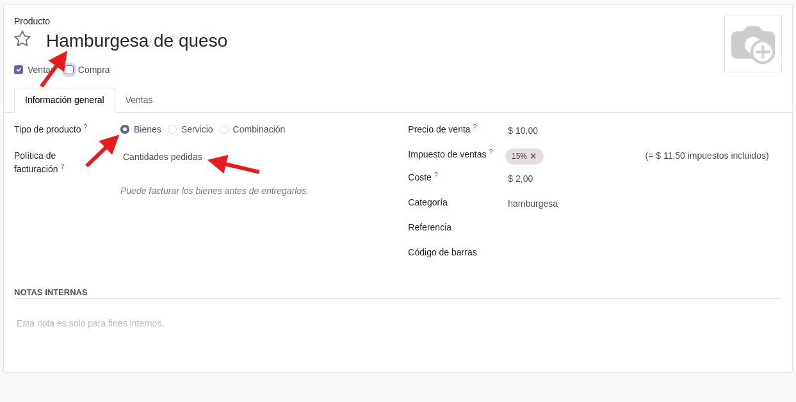

#

A continuació, ens demana el preu de venda del producte, l'impost de venda del producte i el cost de compra del producte.

Finalment, assignarem una categoria al producte; si la categoria escrita no existeix, es crearà automàticament.

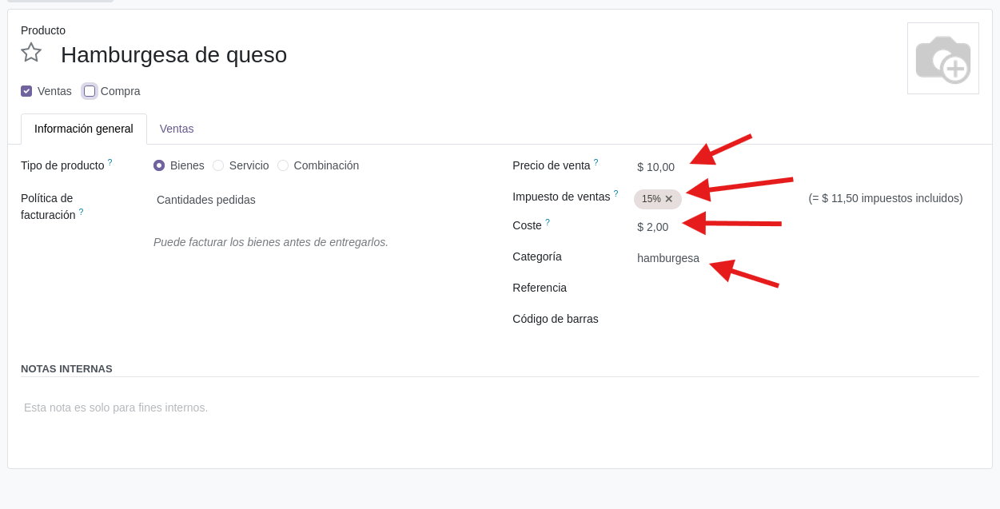

#

El producte es desarà automàticament. Si anem a l'apartat de productes, el podrem trobar allà.

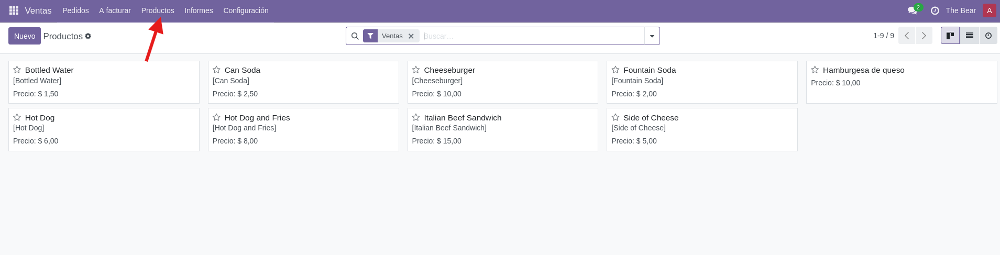

#

El següent apartat que Carmy farà servir molt al seu restaurant serà el de "pedidos".

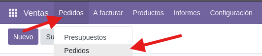

#

En aquest apartat, crearem comandes prement el botó de "Nuevo".

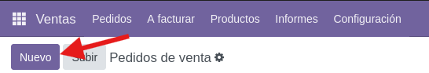

#

Això ens redirigirà a una nova pestanya on posarem el nom del client que ha fet la comanda. Si el client no és a la base de dades, es crearà automàticament.

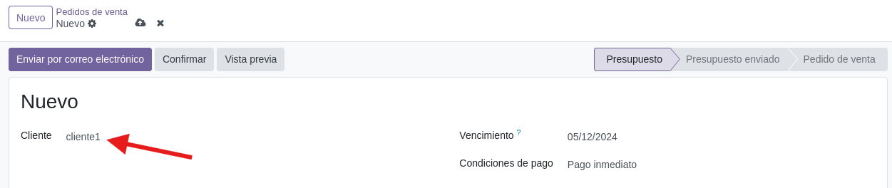

#

A continuació, podem posar una data de venciment i les condicions per al pagament de la comanda.

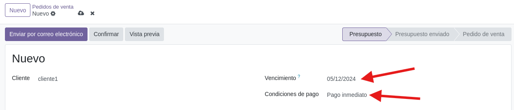

#

Un cop configurades les opcions de pagament, és el moment d’afegir els productes.

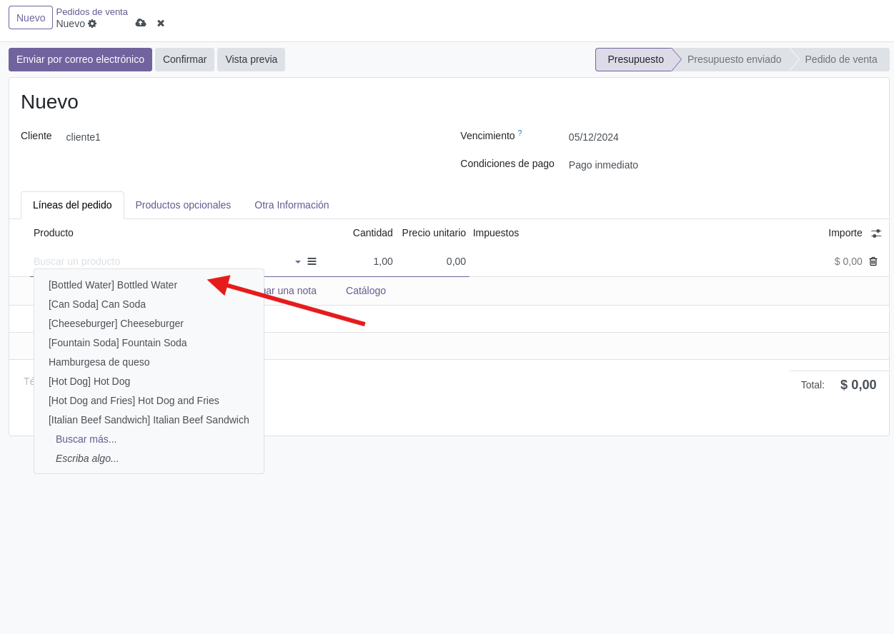

#

Després d’afegir-los, fem clic a "Confirmar" i se’ns crearà automàticament la comanda de venda.

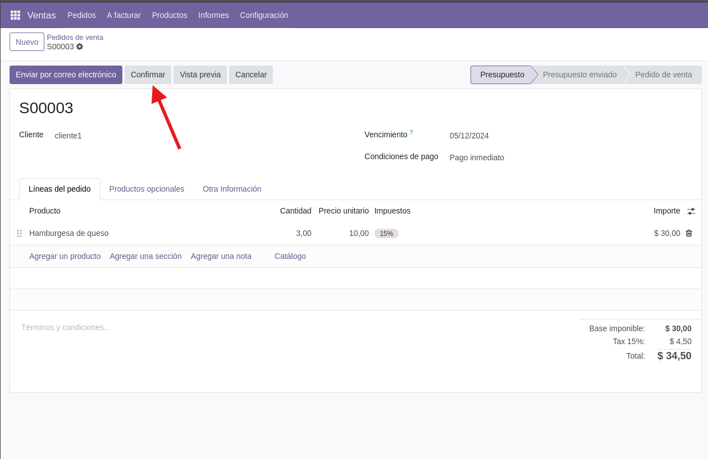

#

Quan el client ens hagi pagat la comanda, podrem fer clic al botó de "Crear factura".

#

Seleccionarem l'opció de factura regular i farem clic a "Crear borrador", tot i que també podem crear un anticipo de la factura si cal.

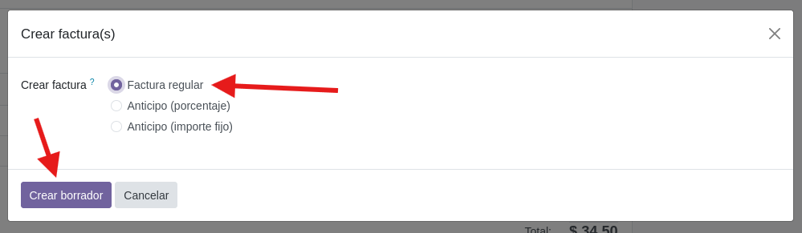

#

Un cop creat el borrador, premeu "Confirmar" i ja tindríem la factura creada, que podrem enviar per correu electrònic al client.

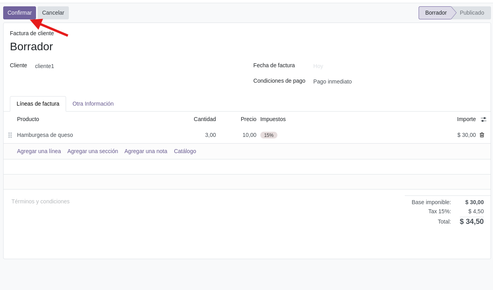

#

A part de poder crear pressupostos i factures, també podem fer un seguiment detallat de la quantitat de vendes que hem realitzat a l'apartat d'informes.

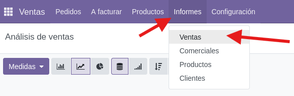

##**Módulo: Compra**

## 1. **Introducción**
Este tutorial es una guía a través del proceso de instalación y configuración del módulo de compras en odoo

## 2. **Instalación del módulo de costos**
1. Acceder a Odoo
2. Dirigirse al menú de aplicaciones
3. Verificar que los módulos contabilidad, inventario y ventas estén instalados previamente
4. Buscar el módulo de **compra**
5. Instalar el módulo

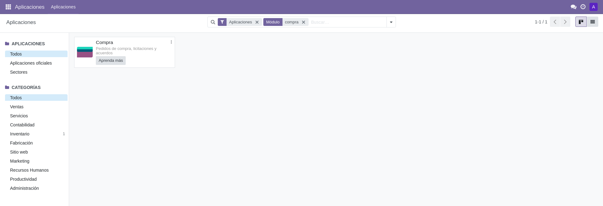

## 3. **Crear productos y añadir costos**
1. Dirigirse a compras
2. Crear nueva solicitud de presupuesto
3. Rellenar campos con detalles del proveedor y los productos

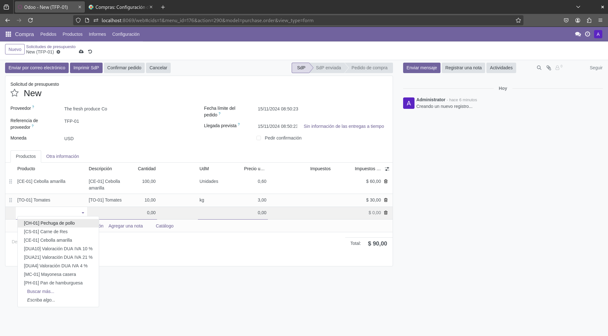

4. Guardar solicitud 

5. Al recibir los productos seleccionar **Recepcionar pedidos**

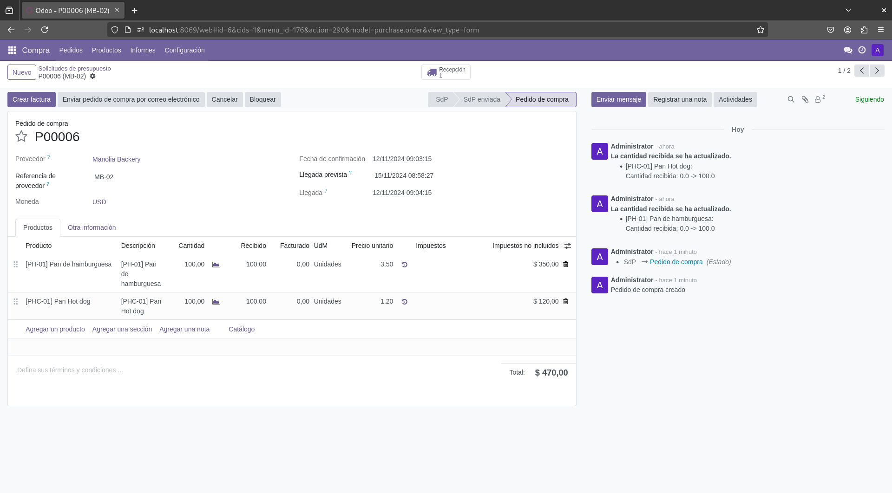

6. Una vez recepcionados seleccionar **Crear factura** y rellenar campos para proceso de pago 

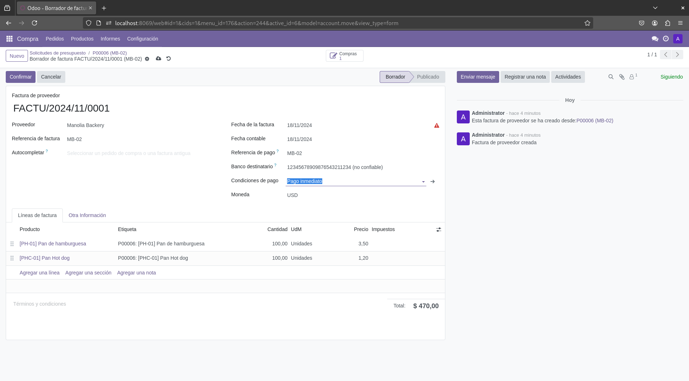

7. Confirmar factura y validar traslado 

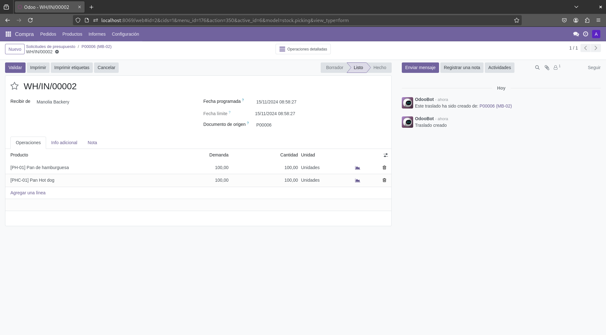

8. Al finalizar se puede visualizar el proceso de compra finalizado 

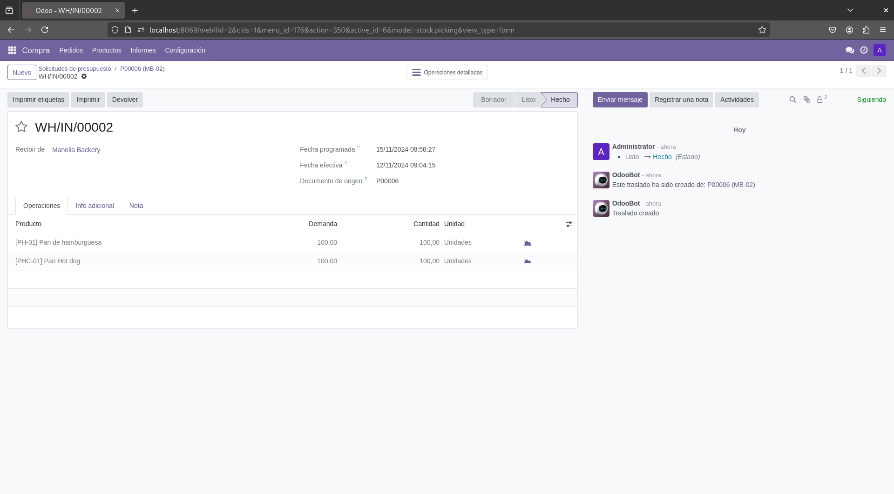

9. Al visualizar las compras de nuevo se pueden ver en detalle cada una de ellas 

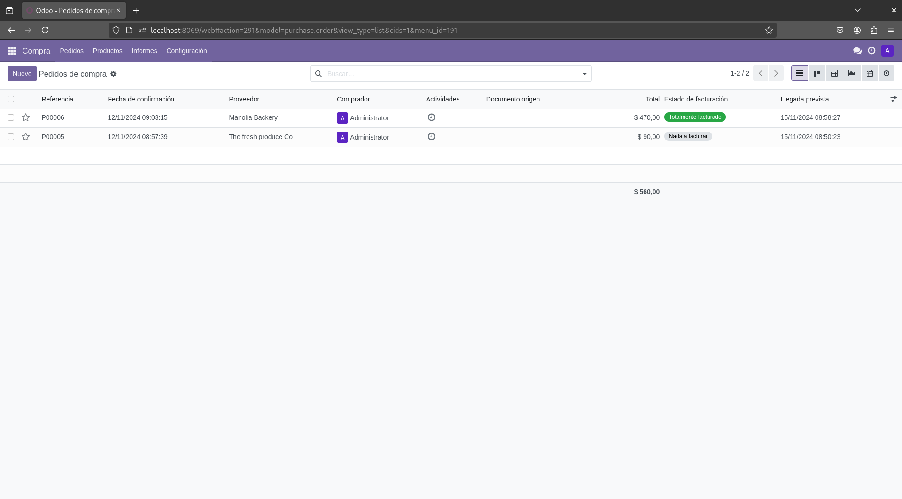

## Mòdul d'Events

En aquest mòdul podem gestionar de forma eficient tota la informació dels events. Quan entrem, es poden gestionar apartats com: **Events**, **Mostrador d'inscripcions**, **Informes** i la **Configuració dels Events**.

## Events

Accedeix al mòdul d'Events des del menú principal, on podràs veure els events de l'empresa amb la seva informació detallada.

### Creació i Configuració d'Events

Al panell principal, selecciona **"Nou"** per afegir un nou event.

#### Dades Principals

L'eina d'Events permet a l'empresa crear events personalitzats des de zero. Té diferents apartats:

- **Entrades**: Permet definir les característiques de les entrades de l'event, configurant aspectes importants per a la venda i control d'assistents.

- **Comunicació**: Permet enviar missatges automàtics als assistents de l'event i configurar recordatoris.

- **Preguntes**: Permet configurar preguntes personalitzades per recopilar informació addicional dels assistents al moment de registrar-se.

#### Estats de l'Event

Estant dins d'un event ja creat, pots modificar el seu estat per reflexar en quina etapa es troba el procés d'organització (Nou, Reservat, Anunciat, Finalitzat, Cancel·lat…).

## Informes

Dins del mòdul, la secció d'informes et permet obtenir un anàlisi detallat sobre el rendiment dels events, amb enfocament en els assistents i els ingressos.

- **Assistents**: Obté un informe sobre les persones que han assistit o s'han registrat per l'event i el seu estat (confirmat, en espera, cancel·lat).

- **Ingressos**: Proporciona un informe detallat sobre els ingressos generats per l'event, útil per avaluar la rendibilitat i l'èxit econòmic.

## Configuració

Dins d'aquesta finestra es pot personalitzar la gestió dels events.

- **Plantilles d'Events**: Permet crear formats predefinits per als events.
- **Etapes de l'Event**: Ajuda a gestionar l'estat dels events.
- **Etiquetes de l'Event**: Classifica els events segons la categoria (tipus d'event, temàtica).

## Mòdul de Calendari

Per poder treballar amb el mòdul de calendari primer hem d'instal·lar-lo

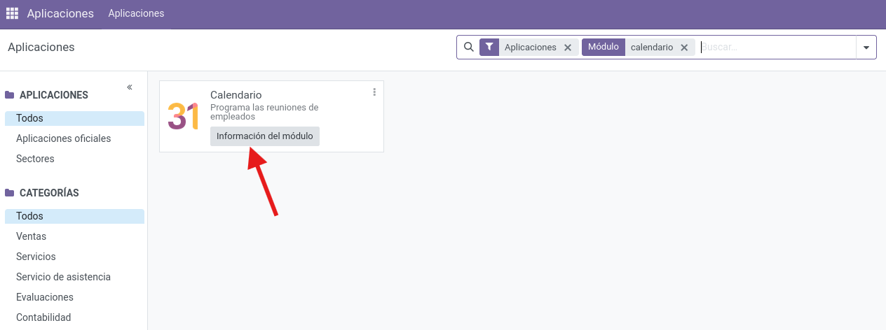

#

Un cop instal·lat ens dirigim a l'apartat de "Calendario"

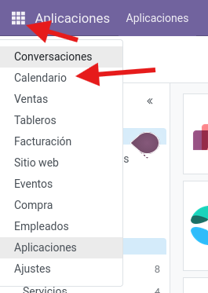

#

Primer anem a la configuració

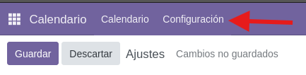

#

En les opcions podem sincronitzar el calendari d'Outlook o el de Google

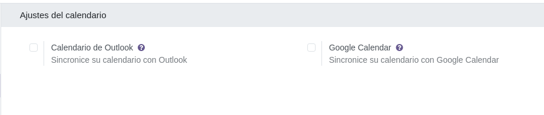

#

La principal funció d'aquest mòdul és la de crear reunions amb els empleats o clients.

Per fer-ho hem de clicar on posa "Nuevo".

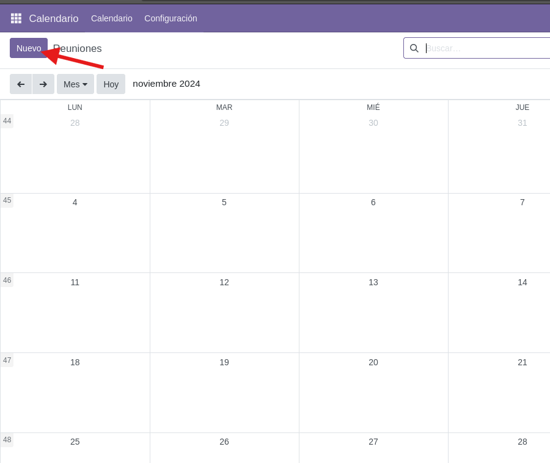

#

Li posarem un assumpte a la reunió per exemple "Planificació Setmana".

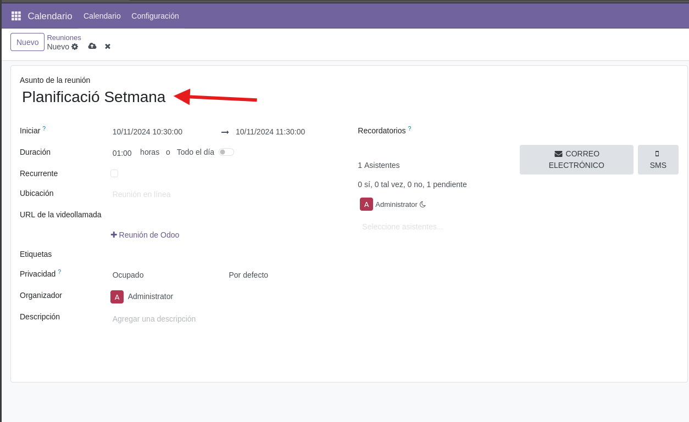

#

Després hem de assignar una data

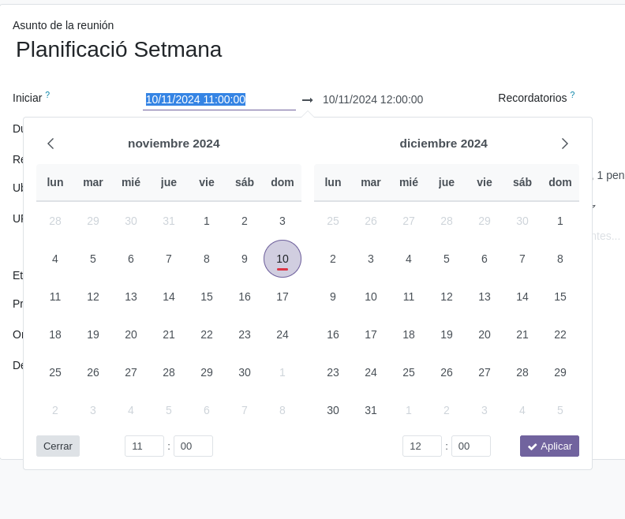

#

Una funció molt interessant és que podem crear videotrucades des del mateix Odoo.

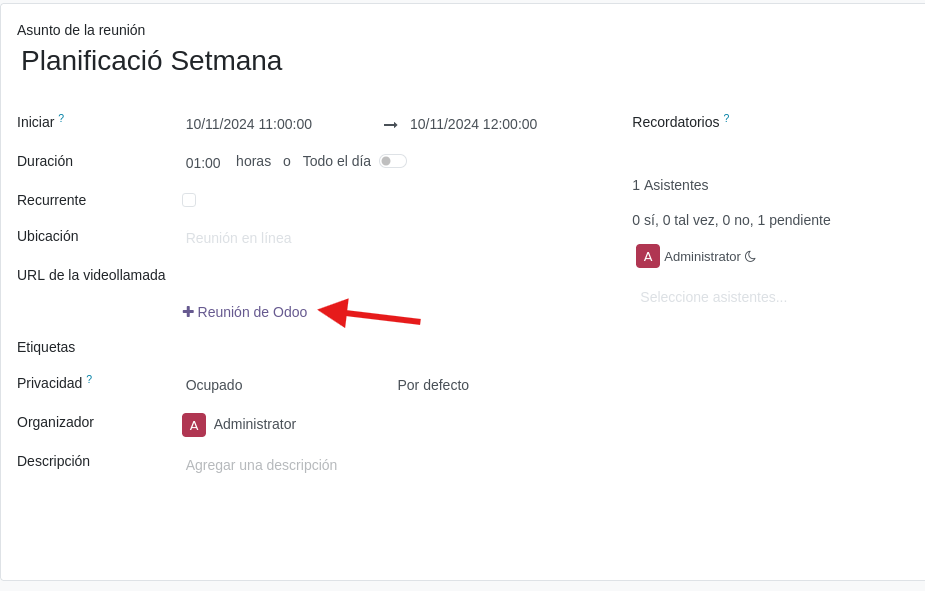

#

Per últim hem de seleccionar els assistents i podem posar-li una descripció a la reunió.

També tenim l'opció d'enviar un recordatori per email o SMS als participants de la reunió

Quedaria una cosa així.

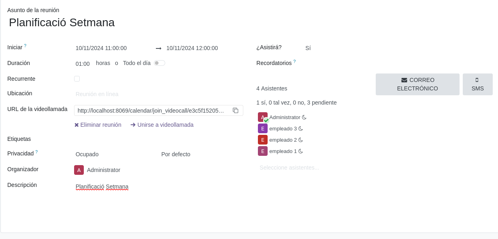

## **Módulo: Costos**

## 1. **Introducción**
Este tutorial es una guía a través del proceso de instalación y configuración del módulo de costos en Odoo

## 2. **Instalación del módulo de costos**
1. Acceder a Odoo
2. Dirigirse al menú de aplicaciones
3. Verificar que los módulos compra, contabilidad, inventario y ventas estén instalados previamente
4. Buscar el módulo de **productos y listas de precios** o ** costos**
5. Activar el módulo

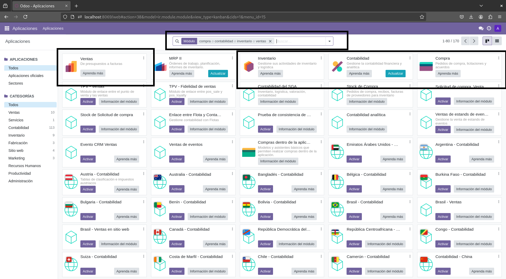

## 3. **Configuración del módulo**
1. Dirigirse a configuración
2. En los apartados de compra e inventario habilitar las funciones de producto 
3. Activar variantes y las unidades de medida

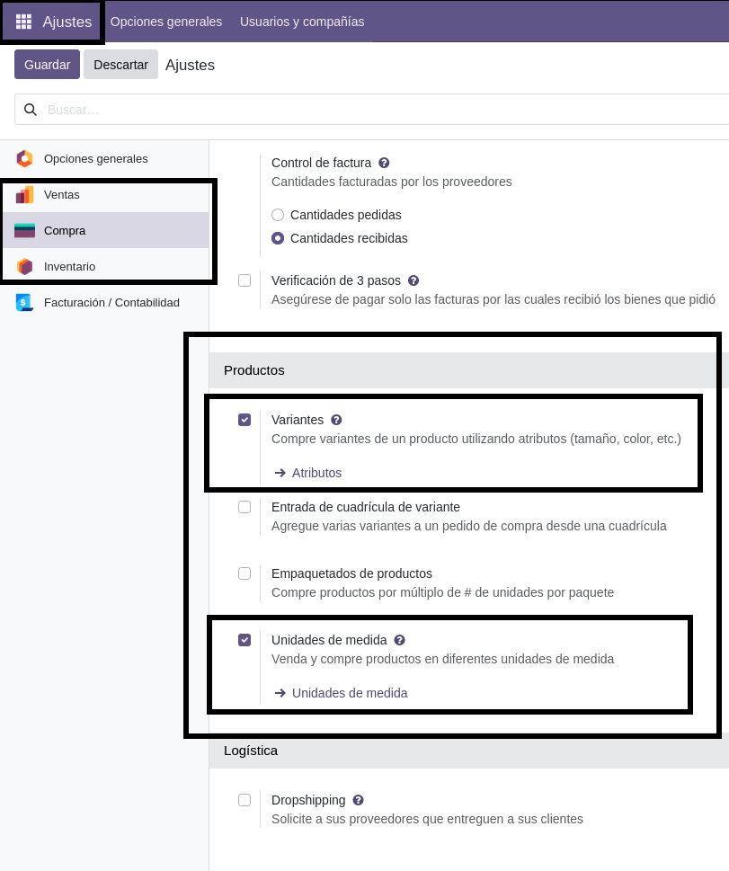

## 4. **Crear productos y añadir costos**
1. Dirigirse a inventario o compras
2. Seleccionar productos
3. Crear Nuevo producto

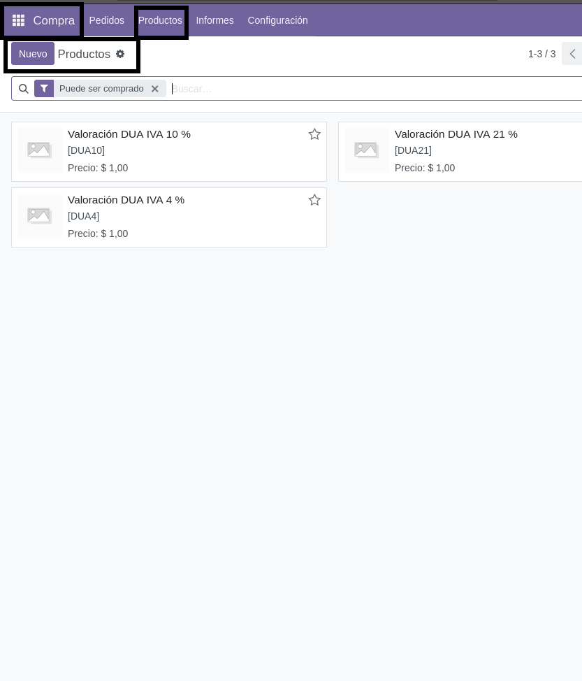

4. Rellenar campos con detalles del producto

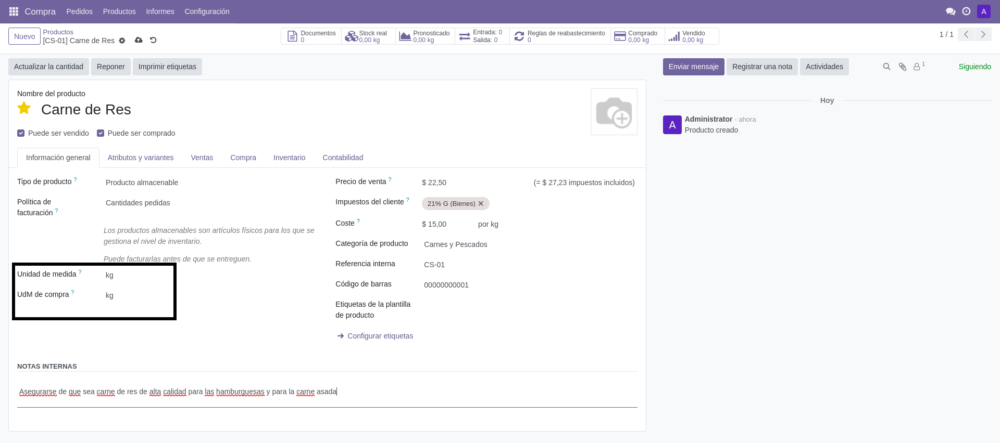

5. Al definir la unidad de medida del producto se desplega la tabla de unidades; seleccionar la deseada

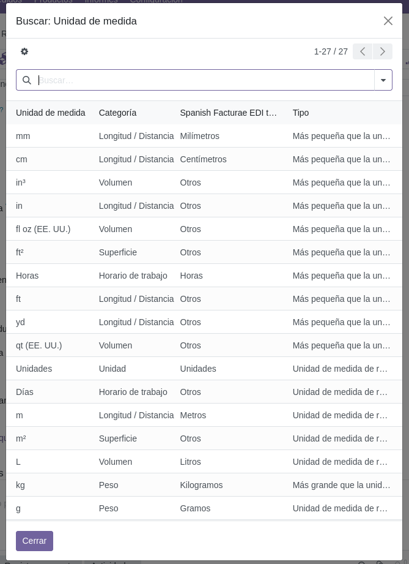
 
6. Añadir costos
7. Guardar

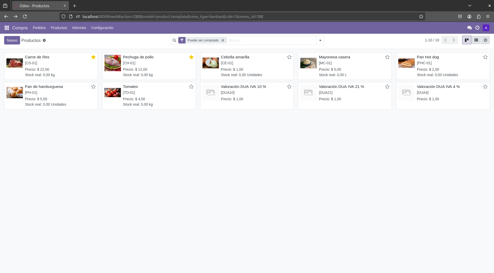

# Mòdul de Punt de Venda (PoS)
Aquest mòdul és ideal per a negocis que venen directament al client, com botigues, restaurants o cafeteries.

## 1. Configuració inicial

Instal·lar el mòdul:

1. Ves a Aplicacions.
2. Cerca "Punt de Venda" i fes clic a Instal·lar.

Crear un punt de venda:

1. Accedeix al mòdul de Punt de Venda.
2. Al menú superior, selecciona Configuració > Punts de Venda.
3. Fes clic a Crear i defineix:
  3.1 Nom del punt de venda.
  3.2 Mètodes de pagament (efectiu, targeta, etc.).
  3.3 Maquinari connectat (com impressores o escàners).

Configurar productes:

1.  Ves a Inventari > Productes.
2. Activa l'opció Disponible en el Punt de Venda per als productes que vulguis vendre.

## 2. Ús del Punt de Venda

Obre una sessió:

1. Selecciona el punt de venda i fes clic a Nova sessió.

Realitza una venda:

1. Escaneja o selecciona els productes al sistema.
2. Aplica descomptes o ajusta quantitats si cal.
3. Tria el mètode de pagament i completa la venda.

Tanca la sessió:

1. Al final del dia, tanca la sessió per obtenir un resum de les vendes.

# Mòdul de Planificació
Aquest mòdul t’ajuda a gestionar horaris, assignar tasques i organitzar el temps del teu equip.

## 1. Configuració inicial

Instal·lar el mòdul:

1. Ves a Aplicacions.
2. Cerca "Planificació" i fes clic a Instal·lar.

Configurar empleats i horaris:

1. Ves a Planificació > Empleats per afegir els membres del teu equip.
2. Defineix els seus horaris laborals i rols.

Crear plantilles de tasques (opcional):

1. Ves a Planificació > Plantilles i crea plantilles per a activitats recurrents.
2. Crear un calendari

Assignar tasques:

1. Ves a Planificació > Calendari.
2. Selecciona el període i fes clic a Afegir per crear un nou torn.
3. Assigna un empleat, defineix l’horari i la tasca específica.

Publicar els horaris:

1. Un cop complet, fes clic a Publicar per notificar als empleats.

Revisar la disponibilitat:

1. Utilitza la vista de calendari per evitar conflictes o superposicions.